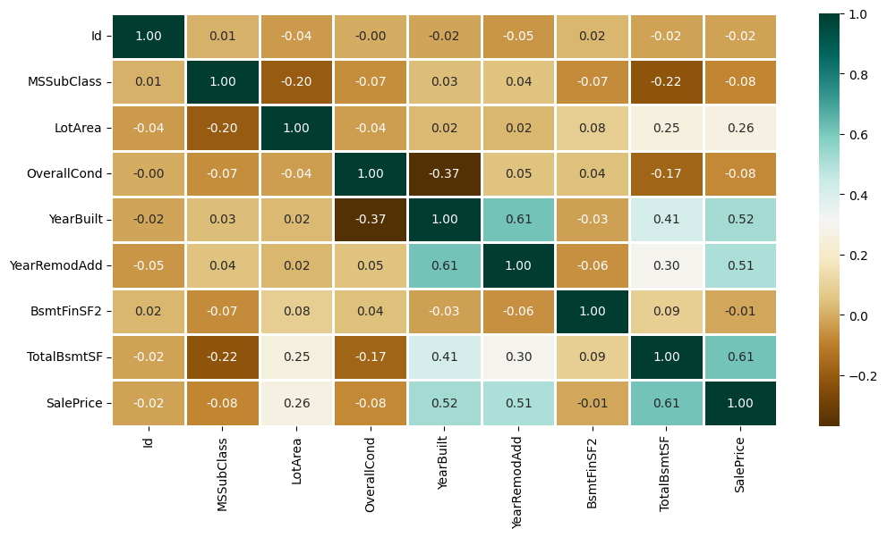

# 🏠 Housely - House Price Predcition 🏠

Author : Adenusi David

### Problem description:

##### House Price Prediction

- We all have experienced a time when we have to look up for a new house to buy. But then the journey begins with a lot of frauds, negotiating deals, researching the local areas and so on.

- Train a machine learning model which can predict the price of a house to streamline the whole hassle that comes with buying a house.

link to [dataset](https://media.geeksforgeeks.org/wp-content/uploads/20240905183434/HousePricePrediction.xlsx)

#### Process

- Pick a relevant problem and dataset
- Explain the problem and how a model can solve it
- Clean data and explore features
- Train, tune, and select the best model
- Convert your notebook to a script
- Containerize and deploy your model locally with Docker

I made a [video](./assests/demo.mp4) of local deployment with docker and using streamlit platform to deploy.

### Description of the dataset

It has 2919 entries

1 Id To count the records.
2 MSSubClass Identifies the type of dwelling involved in the sale.
3 MSZoning Identifies the general zoning classification of the sale.
4 LotArea Lot size in square feet.
5 LotConfig Configuration of the lot
6 BldgType Type of dwelling
7 OverallCond Rates the overall condition of the house
8 YearBuilt Original construction year
9 YearRemodAdd Remodel date (same as construction date if no remodeling or additions).
10 Exterior1st Exterior covering on house
11 BsmtFinSF2 Type 2 finished square feet.
12 TotalBsmtSF Total square feet of basement area
13 SalePrice To be predicted

### EDA

You can find the EDA in this [notebook](./notebooks/notebook.ipynb) and this improved 2nd [notebook](./notebooks/notebook1.ipynb)

### Missing values

We'll drop the missing values as it have no signigicant effect on our model

### Feature Importance

  

## Model training
I used a Logistic Regression model, a Decision Tree and SVM model. I used Mean squared percentage error (MSPE) to evaluate the models.
